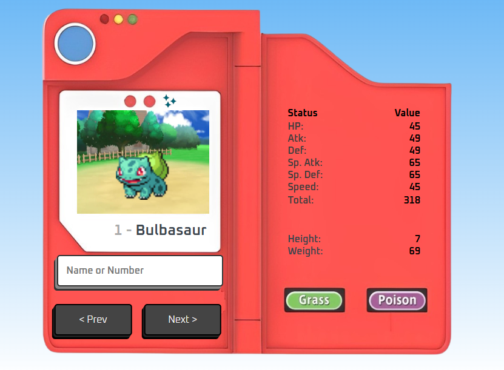
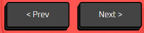

# Pokédex Simples



Este é um projeto de uma Pokédex simples desenvolvida em JavaScript. O objetivo é fornecer uma interface básica para consultar informações sobre Pokémon utilizando a [PokeAPI](https://pokeapi.co/).

## Funcionalidades

- **Busca de Pokémon:** Permite buscar informações sobre um Pokémon específico pelo seu ID ou nome.
- **Exibição de Dados:** Mostra detalhes como nome, número, tipos, altura, peso e estatísticas básicas (HP, ataque, defesa, etc.).
- **Imagens:** Exibe imagens dos Pokémon em diferentes versões (normais e brilhantes) com base no gênero.
- **Mudança de Fundo:** O fundo da Pokédex muda de acordo com o tipo principal do Pokémon (por exemplo, ar, água, luz, noite).
- **Navegação:** Permite navegar entre Pokémon anteriores e seguintes.

## Tecnologias Utilizadas

- HTML
- CSS
- JavaScript
- [PokeAPI](https://pokeapi.co/)

## Como Usar

1. **Clone o Repositório:**
   ```bash
   git clone https://github.com/LeonardoCigalotti/pokedex.git
    ```
2. **Navegue até o Diretório do Projeto:**
    ```bash
    cd pokedex
    ```

3. **Abra o Arquivo :**
    ```bash
    abra o arquivo ´index.html´ em um Navegador: O projeto é executado no navegador e não requer um servidor local.
    ```

## Estrutura do Projeto

- **index.html:** Estrutura HTML da Pokédex.
- **styles.css:** Estilos para a Pokédex.
- **script.js:** Lógica JavaScript para busca e exibição dos dados do Pokémon.

## Exemplos de Uso

<table>
  <tr>
    <td></td>
    <td><strong>Buscar um Pokémon:</strong> Digite o nome ou o ID do Pokémon no campo de busca e pressione Enter para carregar as informações.</td>
  </tr>
  <tr>
    <td></td>
    <td><strong>Navegar entre Pokémon:</strong> Use os botões de próximo e anterior para navegar entre os Pokémon.</td>
  </tr>
  <tr>
    <td></td>
    <td><strong>Forma Shiny:</strong> Se disponível, você pode alternar entre a imagem do Pokémon normal e shiny.</td>
  </tr>
  <tr>
    <td></td>
    <td><strong>Alterar Gênero:</strong> Se disponível, você pode alternar entre a imagem do Pokémon masculino e feminino.</td>
  </tr>
</table>
