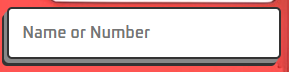

# Simple Pokédex


This is a project for a simple Pokédex developed in JavaScript. The goal is to provide a basic interface for querying information about Pokémon using the [PokeAPI](https://pokeapi.co/).

## Features

- **Pokémon Search:** Allows searching for information about a specific Pokémon by its ID or name.
- **Data Display:** Shows details such as name, number, types, height, weight, and basic statistics (HP, attack, defense, etc.).
- **Images:** Displays images of Pokémon in different forms (normal and shiny) based on gender.
- **Background Change:** The background of the Pokédex changes according to the Pokémon's primary type (e.g., air, water, light, night).
- **Navigation:** Allows navigating between previous and next Pokémon.

## Technologies Used

- HTML
- CSS
- JavaScript
- [PokeAPI](https://pokeapi.co/)

## How to Use

1. **Clone the Repository:**
   ```bash
   git clone https://github.com/LeonardoCigalotti/pokedex.git
   ```

2. **Navigate to the Project Directory:**
    ```bash
    cd pokedex
    ```

3. **Open the File:**
    ```bash
      Open the `index.html` file in a browser: The project runs in the browser and does not require a local server.
    ```

## Project Structure

- **index.html:** HTML structure of the Pokédex.
- **styles.css:** Styles for the Pokédex.
- **script.js:** JavaScript logic for searching and displaying Pokémon data.

## Usage Examples

<table>
  <tr>
    <td></td>
    <td><strong>Search for a Pokémon:</strong> Enter the name or ID of the Pokémon in the search field and press Enter to load the information.</td>
  </tr>
  <tr>
    <td></td>
    <td><strong>Navigate between Pokémon:</strong> Use the next and previous buttons to navigate between Pokémon.</td>
  </tr>
  <tr>
    <td></td>
    <td><strong>Shiny Form:</strong> If available, you can toggle between the normal and shiny image of the Pokémon.</td>
  </tr>
  <tr>
    <td></td>
    <td><strong>Change Gender:</strong> If available, you can toggle between the male and female image of the Pokémon.</td>
  </tr>
</table>
